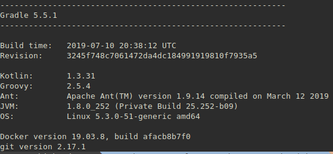
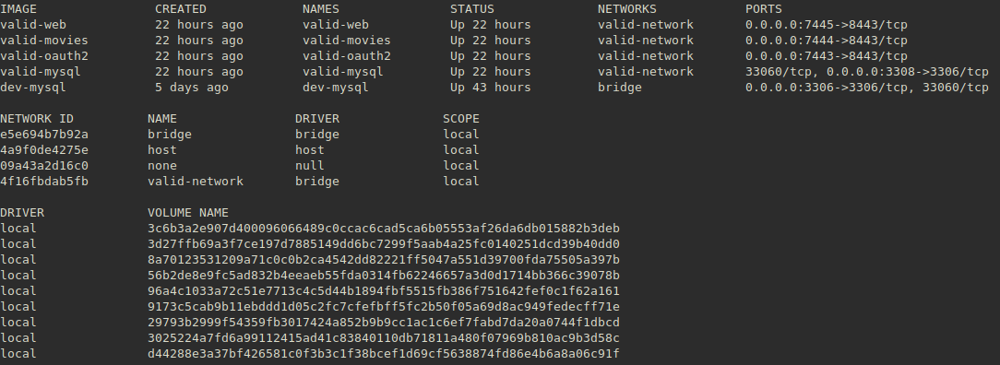

# Valid  Movies Rental
This project was created as part of Valid's Hiring Process ( hope I can get the job :) )

# How to build this project?

## Prerequisites
This project was develop and "tested" on an Ubuntu OS, so you will need a linux-based OS for building and running using the procedure below.

You will need to free at least 2.5GB of your RAM, just for running this project.

Also, your machine will need:
* Java 8+
* Gradle 5.5+
* Docker 18+
* Git 2.17+



## Procedure
1. Create a folder that will hold all the projects. Then we move into that folder.
```bash
mkdir valid-movies-rental-holder
cd valid-movies-rental-holder
```
2. Clone this git repository using either:
```
git@github.com:guidomantilla/Valid-SecureMicroservices
```
or

```
https://github.com/guidomantilla/Valid-SecureMicroservices.git
```
3. Move into new folder

```
cd Valid-SecureMicroservices
```
4. Execute the file

```
sh build-environment.sh
```
5. That's it!! If everything goes well you will have 4 docker containters Up and Running (the ones with the valid-* pattern name) within thier own network (valid-network of course). 



### Note: 
You may have the situation where the mysql database container (**valid-mysql**) it's not ready yet to receive requests. So the movies API container (**valid-movies**) and the oauth2 server container (**valid-oauth2**) will have troubles to start.

In this case, wait for a couple of minutes, and the execute:
```
docker container stop valid-oauth2 valid-movies
docker container start valid-oauth2 valid-movies
```

# Foobar

Foobar is a Python library for dealing with word pluralization.

## Installation

Use the package manager [pip](https://pip.pypa.io/en/stable/) to install foobar.

```bash
pip install foobar
```

## Usage

```python
import foobar

foobar.pluralize('word') # returns 'words'
foobar.pluralize('goose') # returns 'geese'
foobar.singularize('phenomena') # returns 'phenomenon'
```

## Contributing
Pull requests are welcome. For major changes, please open an issue first to discuss what you would like to change.

Please make sure to update tests as appropriate.

## License
[MIT](https://choosealicense.com/licenses/mit/)