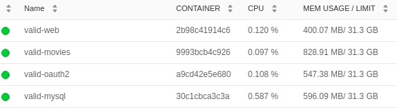
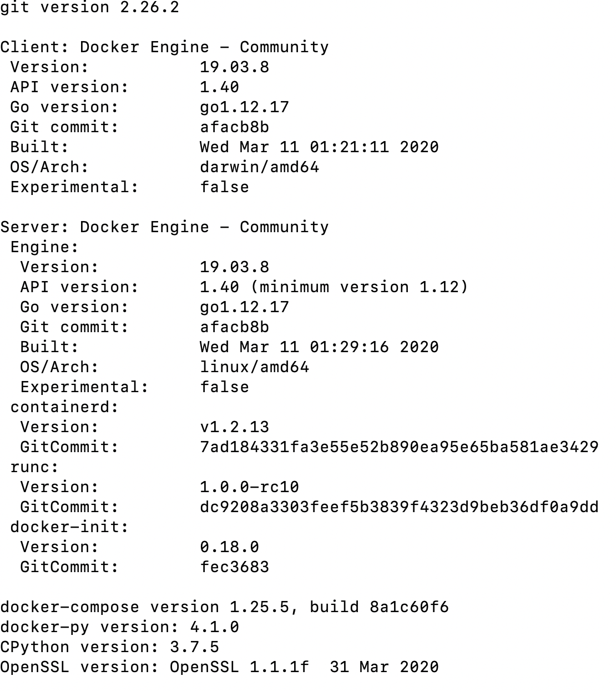
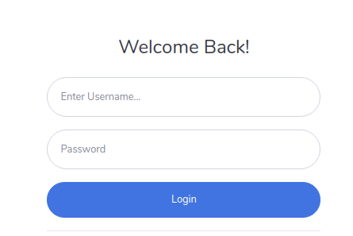
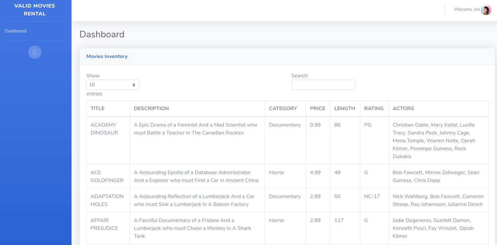
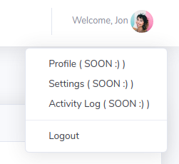
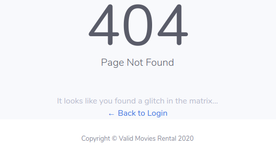

# Valid  Movies Rental
This project was created as part of Valid's Hiring Process.

This is a very basic application, with just 3 use cases:
* Login
* Logout
* Show a movies list

This demo is more about backend security.

Maybe, I will create a full feature web application on a near future.

This project is under [Apache License 2.0](https://choosealicense.com/licenses/apache-2.0/)

# Technical Stuff
You will find all the *stuff that matters* (like Martin Fowler will say it) [here](TECHME.md)


# How to build this project?

## Prerequisites
This project was develop and "tested" on an Ubuntu OS, so you will need a linux-based OS for building and running the project using the procedure below.

You will need to free at least 2.5GB of your RAM, just for running.



Also, your machine will need:
* Docker 18+
* Docker Compose 1.24+
* Git 2.17+



## Procedure
1. Create a folder that will hold all the projects. Then we move into that folder.
```bash
mkdir valid-movies-rental-holder
cd valid-movies-rental-holder
```
2. Clone this git repository using either:
```
git@github.com:guidomantilla/Valid-SecureMicroservices
```
or

```
https://github.com/guidomantilla/Valid-SecureMicroservices.git
```
3. Move into new folder

```
cd Valid-SecureMicroservices
```
4. Execute the file

```
sh build-environment.sh
```
5. That's it!! If everything goes well you will have 4 docker containters Up and Running (the ones with the valid-* pattern name) within thier own network (valid-network of course). 


#### Note: 
You may have the situation where the mysql database container (**valid-mysql**) it's not ready to receive requests yet. So the movies API container (**valid-movies**) and the oauth2 server container (**valid-oauth2**) will have troubles to start.

In this case, wait for a couple of minutes, and the execute:
```
docker container stop valid-oauth2 valid-movies
docker container start valid-oauth2 valid-movies
```

# What just happend? 
In the procedure above, we execute the file 

```
sh build-environment.sh
```
The file executes the following:
1. **Delete local docker environment**: This file will create a docker environment for running and testing this project, and it is expected that you will run this file many times. So, the first thing this file does, is deleting that docker environment. 
```
docker container rm --force valid-mysql
docker container rm --force valid-oauth2
docker container rm --force valid-movies
docker container rm --force valid-web
docker network rm valid-network
```

2. **Delete local git repositories**: The same reasoning from above, but for the local repositories.
```
rm -rf valid_mysql-scripts
rm -rf valid_oauth2-server
rm -rf valid_movies-api
rm -rf valid_movies-web
```

3. **Create local git repositories**.
```
git clone https://github.com/guidomantilla/valid_mysql-scripts.git
git clone https://github.com/guidomantilla/valid_oauth2-server.git
git clone https://github.com/guidomantilla/valid_movies-api.git
git clone https://github.com/guidomantilla/valid_movies-web.git
```

4. **Create local docker environment**: This file will use `docker-compose` to execute a docker-compose.yml file.  
```yml
version: "3.8"

services:
  valid-mysql:
    build:
      context: ../valid_mysql-scripts/
    image: valid-mysql
    container_name: valid-mysql
    restart: always
    environment:
      MYSQL_ROOT_HOST: "%"
      MYSQL_ROOT_PASSWORD: v4l1d-gu1d0-m4nt*
    ports:
      - 3308:3306
      - 33080:33060
    networks:
      - valid-network

  valid-oauth2:
    build:
      context: ../valid_oauth2-server/
    image: valid-oauth2
    container_name: valid-oauth2
    restart: always
    environment:
      VALID_APP_NAME: valid-oauth2
      VALID_MYSQL_HOSTNAME: valid-mysql
    ports:
      - 7443:8443
    networks:
      - valid-network
    depends_on:
      - valid-mysql

  valid-movies:
    build:
      context: ../valid_movies-api/
    image: valid-movies
    container_name: valid-movies
    restart: always
    environment:
      VALID_APP_NAME: valid-movies
      VALID_MYSQL_HOSTNAME: valid-mysql
    ports:
      - 7444:8443
    networks:
      - valid-network
    depends_on:
      - valid-mysql

  valid-web:
    build:
      context: ../valid_movies-web/
    image: valid-web
    container_name: valid-web
    restart: always
    environment:
      VALID_APP_NAME: valid-movies
      VALID_MOVIES_OAUTH2_HOSTNAME: valid-oauth2
      VALID_MOVIES_API_HOSTNAME: valid-movies
    ports:
      - 7445:8443
    networks:
      - valid-network
    depends_on:
      - valid-oauth2
      - valid-movies

networks:
  valid-network:
    name: valid-network
    driver: bridge

```

# How to use the application?

#### Note: 
You will find the situation where the SSL Certificate used for this application will not be recognized by the lastest version of your browser. In my case, Safari did the work.

Once all docker containers are up and running, you can open your browser and enter:
```
https://localhost:7445/
```
Then you can use any of these credentials:
```
user: Admin   password: password
user: Jon     password: password
user: Mike    password: password
```


Then, the application redirect you to the home screen.



On the right corner, you will basic a very basic user info. There you will find the logout option.



If you enter any invalid URL, the application will show you a 404 page.

